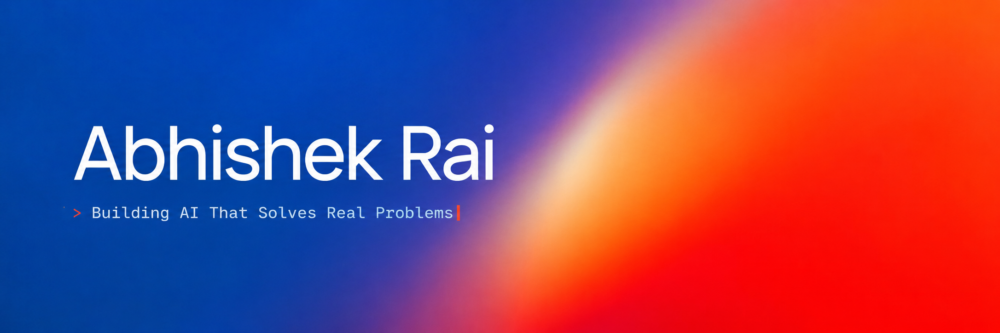

  
   
  

 

&nbsp;&nbsp;

&nbsp;&nbsp;

 

## About

I build intelligent systems that **see, learn, and decide**.

My work sits at the intersection of **AI, computer vision, machine learning, optimization, and engineering systems**. I like taking ideas beyond notebooks and turning them into products, tools, and workflows that solve real problems.

 

## Featured Projects

<table>
<tr>

<td width="33%" valign="top">

### [SURGE](https://github.com/cookedaryan/surge)

A **33 kV route optimization application** focused on engineering-first planning and optimization workflows.

`Python` · `Optimization` · `Graph Search` · `Power Systems`

</td>

<td width="33%" valign="top">

### [NeuroOne](https://github.com/NeuroOne-org/NeuroOne-V1)

An **AI-powered medical imaging and clinical decision support platform** growing toward a multimodal healthcare AI ecosystem.

`Medical AI` · `Computer Vision` · `Multimodal AI`

</td>

<td width="33%" valign="top">

### [Snapgrade](https://github.com/ofcourseabhishek/FocalPointAI)

A **computer-vision feedback platform** that analyzes photographs, explains findings, and generates practical critique reports.

`Computer Vision` · `Image Analysis` · `AI Feedback`

</td>

</tr>
</table>

 

## Tools I Built

<table>
<tr>

<td width="33%" valign="top">

### [AGY-ORC](https://github.com/ofcourseabhishek/agy-orc)

A lightweight orchestration tool for automating and coordinating everyday AI workflows.

`Automation` · `AI Tooling`

</td>

<td width="33%" valign="top">

### [NetworkRouser](https://github.com/ofcourseabhishek/arknet)

A cross-platform Wi-Fi agent that detects captive-portal connectivity and keeps authenticated internet access alive.

`Networking` · `Automation` · `Cross-platform`

</td>

<td width="33%" valign="top">

### [AI Engineering Council](https://github.com/ofcourseabhishek/ai-engineering-council)

A multi-model engineering debate workflow:

**propose → critique → score → decide → implement**

`Agents` · `Engineering Workflow` · `AI Tooling`

</td>

</tr>
</table>

 

---

Build useful things. Measure them. Improve them. Ship them.

