<div align="center">



<a href="https://git.io/typing-svg">
  
</a>

</div>

```text
    ___    ____  __  ___________ __  __________ __
   /   |  / __ )/ / / /  _/ ___// / / / ____/ //_/
  / /| | / __  / /_/ // / \__ \/ /_/ / __/ / ,<   
 / ___ |/ /_/ / __  // / ___/ / __  / /___/ /| |  
/_/  |_/_____/_/ /_/___//____/_/ /_/_____/_/ |_|  

╭─────────────────────────────────────────────────────────╮
│ abhishek@github ~ %                                      │
│                                                           │
│ $ whoami                                                 │
│ > full-stack dev · ML tinkerer · 33kV route optimizer    │
│                                                           │
│ $ git commit -m "should I push this?"                    │
│ > Nah, I'd commit.                                       │
╰─────────────────────────────────────────────────────────╯
```

### About

- 🎯 Focusing
- 📍 India (UTC+5:30)
- 🔭 Currently building **[NeuroOne](https://github.com/NeuroOne-org/NeuroOne-V1)** — AI-powered medical imaging and clinical decision support, starting with neurodegenerative disease
- 🌱 Also shipping **[SURGE](https://github.com/cookedaryan/surge)** (33kV collector route optimization) and **[FocalPointAI](https://github.com/ofcourseabhishek/FocalPointAI)** (computer-vision photo feedback)
- 💬 Ask me about route optimization, computer vision, or turning research into something that ships

<div align="center">

<a href="https://www.linkedin.com/in/abhishek--rai/" target="_blank"></a>&nbsp;&nbsp;
<a href="https://www.instagram.com/ofcourse.abhishek/" target="_blank"></a>

</div>

### Tech stack

<div align="center">

&nbsp;
&nbsp;
&nbsp;
&nbsp;
&nbsp;
&nbsp;
&nbsp;
&nbsp;


</div>

### Featured projects

| | |
|---|---|
| **[SURGE](https://github.com/cookedaryan/surge)** | A 33kV collector route optimization engine. Deterministic engineering, not a black box. `Python` |
| **[NeuroOne](https://github.com/NeuroOne-org/NeuroOne-V1)** | AI-powered medical imaging and clinical decision support, starting with neurodegenerative disease analysis and expanding into a multimodal healthcare AI ecosystem. `TypeScript` |
| **[FocalPointAI](https://github.com/ofcourseabhishek/FocalPointAI)** | Analyzes a photograph with deterministic computer-vision measurements, explains the findings in plain photography language, and recommends what to learn next. `HTML` |

### GitHub stats

<div align="center">


</div>

### Contribution snake

<div align="center">

<picture>
  <source media="(prefers-color-scheme: dark)" srcset="https://raw.githubusercontent.com/ofcourseabhishek/ofcourseabhishek/output/github-contribution-grid-snake-dark.svg" />
  <source media="(prefers-color-scheme: light)" srcset="https://raw.githubusercontent.com/ofcourseabhishek/ofcourseabhishek/output/github-contribution-grid-snake.svg" />
  
</picture>

<sub>Regenerates on a schedule via the workflow in <code>.github/workflows/snake.yml</code> — see setup notes below.</sub>

</div>

<div align="center">

</div>
